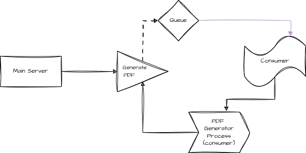

# About

RabbitMQ with Node.js to achieve RPC (Remote Procedure Call) communication flawlessly..



To download and install RabbitMQ server:
https://www.rabbitmq.com/docs/download

To run consumer:
```shell
npm run consumer
```

To run producer:
```shell
npm run producer
```